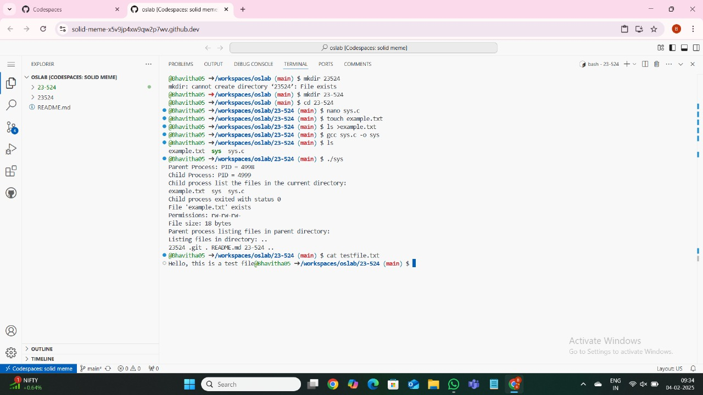

> ### To implement UNIX operating system calls fork, exec, getpid, exit, wait, close, stat, opendir and readdir
SOurce Code:
```C
#include <stdio.h>
#include <stdlib.h>
#include <sys/types.h>
#include <sys/wait.h>
#include <sys/stat.h>
#include <unistd.h>
#include <dirent.h>
#include <fcntl.h>

void print_permissions(mode_t mode) {
    char perms[10];

    // User permissions
    perms[0] = (mode & S_IRUSR) ? 'r' : '-';
    perms[1] = (mode & S_IWUSR) ? 'w' : '-';
    perms[2] = (mode & S_IXUSR) ? 'x' : '-';

    // Group permissions
    perms[3] = (mode & S_IRGRP) ? 'r' : '-';
    perms[4] = (mode & S_IWGRP) ? 'w' : '-';
    perms[5] = (mode & S_IXGRP) ? 'x' : '-';

    // Other permissions
    perms[6] = (mode & S_IROTH) ? 'r' : '-';
    perms[7] = (mode & S_IWOTH) ? 'w' : '-';
    perms[8] = (mode & S_IXOTH) ? 'x' : '-';

    perms[9] = '\0';  // Null-terminate the string

    printf("Permissions: %s\n", perms);
}

void list_directory(const char *path) {
    DIR *dir = opendir(path);
    struct dirent *entry;
    
    if (dir == NULL) {
        perror("opendir");
        return;
    }

    printf("Listing files in directory: %s\n", path);
    while ((entry = readdir(dir)) != NULL) {
        printf("%s ", entry->d_name);
    }
    printf("\n");

    closedir(dir);
}

int main() {
    pid_t pid;
    int status;
    struct stat file_info;

    // Using fork to create a new child process
    pid = fork();
    if (pid < 0) {
        perror("fork failed");
        exit(1);
    }

    if (pid == 0) {  // Child process
        printf("Child Process: PID = %d\n", getpid());
	printf("Child process list the files in the current directory:\n");
        // Using exec to replace the process image
        execlp("/bin/ls", "ls", NULL);  // List files in the current directory
        perror("exec failed");  // If exec fails
        exit(1);
    } else {  // Parent process
        printf("Parent Process: PID = %d\n", getpid());
        
        // Wait for the child process to finish
        wait(&status);
        if (WIFEXITED(status)) {
            printf("Child process exited with status %d\n", WEXITSTATUS(status));
        }

        // Using stat to get information about a file
        if (stat("example.txt", &file_info) == 0) {
            printf("File 'example.txt' exists\n");
            print_permissions(file_info.st_mode);  // Print human-readable permissions
            printf("File size: %ld bytes\n", file_info.st_size);
        } else {
            perror("stat failed");
        }

        // Using opendir and readdir to list files in a directory
	printf("Parent process listing files in parent directory:\n");
        list_directory("..");

        // Demonstrating file operations with open, write, and close
        int fd = open("testfile.txt", O_WRONLY | O_CREAT, 0644);
        if (fd == -1) {
            perror("open failed");
            exit(1);
        }
        
        write(fd, "Hello, this is a test file!\n", 26);
        close(fd);  // Closing the file

        // Exit the parent process
        exit(0);
    }
}
```

